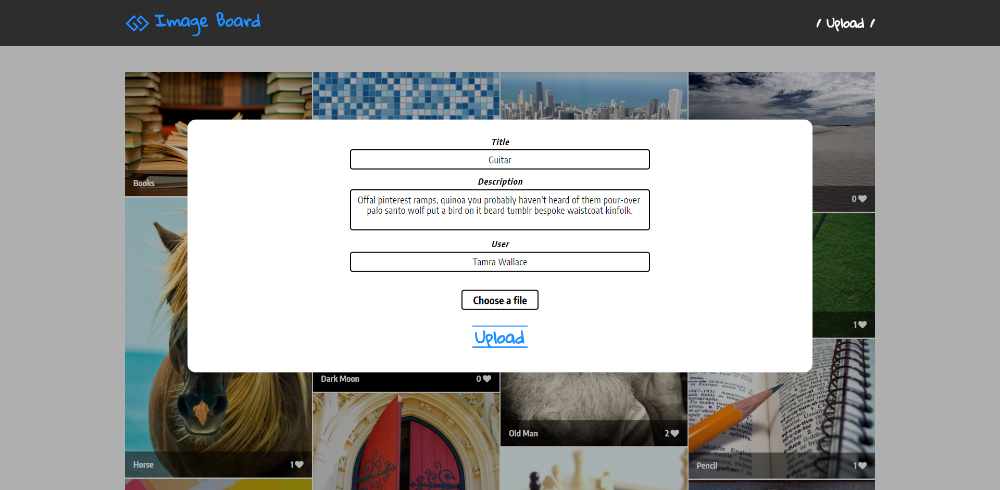

# Image Board

Image Board is a Full Stack application that allow users to upload images and interact with pictures uploaded by others, by commenting and liking them.

Main technologies used:
*   Backbone
*   Express JS
*   PostgreSQL
*   AWS S3

### Description

Latest uploaded pictures are displayed on the main page.

 
 

When clicking on 'Upload' a modal is rendered. There you can select a file from your file system, give it name & description and finally upload it on AWS S3.

 
 

Clicking on an picture shows it at full size. 
Users can add comments and/or like the image. 
The application doesn't require login, so I used cookies to keep track of likes.

 
 
